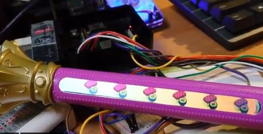

# Driver for majoca Iris LCD (fbtft mod)

マジョカアイリスLCD の ラズパイ用 mod ドライバーです。

フレームバッファとして使えるようになります。

（カーネル5.4 からfbtft の構成が大きく変わりましたが、これは5.x でも 4.x でもOKです。）

<BR>
<BR>

# 動いてる様子




https://twitter.com/devemin/status/1351562926616788994

https://twitter.com/devemin/status/1351198449442709508

https://twitter.com/devemin/status/1351214926707175432

https://twitter.com/devemin/status/1351187167314325506

https://twitter.com/devemin/status/1351338649116311552


<BR>
<BR>


# 確認環境

ラズパイ4 8gB /  2021-1-11 released Raspberry Pi OS, カーネル 5.4.83-v7l+

ラズパイ3B+ /  2021-1-11 released Raspberry Pi OS, カーネル 5.4.83-v7+

ラズパイ3B+ /  2019-4-8 released Raspian OS, カーネル 4.14.98-v7+


<BR>
<BR>
<BR>

# HOWTO


# マジョカアイリスLCD の配線

```
(LCD :	ラズパイ)
reset:	21
WR:	23
CS:	24
DC:	22
DB0:	5
DB1:	6
DB2:	13
DB3:	19
DB4:	26
DB5:	12
DB6:	16
DB7:	20

LCD pin
1	-	(GND)
2	-	reset	(ラズパイ	gpio-21)
3	-	(GND)
4	-	DB0	(ラズパイ	gpio-5)
5	-	DB1	(ラズパイ	gpio-6)
6	-	DB2	(ラズパイ	gpio-13)
7	-	DB3	(ラズパイ	gpio-19)
8	-	DB4	(ラズパイ	gpio-26)
9	-	DB5	(ラズパイ	gpio-12)
10	-	DB6	(ラズパイ	gpio-16)
11	-	DB7	(ラズパイ	gpio-20)
12	-	(GND)
13	-	RD	(3.3V へ！)
14	-	WR	(ラズパイ	gpio-23)
15	-	CS	(ラズパイ	gpio-24)
16	-	DC	(ラズパイ	gpio-22)
17	-	TE	(未配線)
18	-	VDD	(3.3V)
19	-	VDDIO	(3.3V)
20	-	LED+	(茶フレキ基板液晶なら5.5V～、みどり基板液晶なら12V～)
21	-	LED-	(GND)
22	-	(GND)

```


### 配線の様子


### GPIO ピン配置　参考

→　https://deviceplus.jp/hobby/raspberrypi4_04/

### 細長液晶側のピン配置

参考→　https://github.com/htlabnet/inside_magimajopures/blob/main/640x48_LCD_ESP32/640x48_LCD_ESP32.ino

<BR>
<BR>
<BR>

# インストール

```
# カーネルソースの準備

sudo apt update 
sudo apt install git bc bison flex libssl-dev
sudo wget https://raw.githubusercontent.com/RPi-Distro/rpi-source/master/rpi-source -O /usr/local/bin/rpi-source && sudo chmod +x /usr/local/bin/rpi-source && /usr/local/bin/rpi-source -q --tag-update
sudo rpi-source

# https://github.com/RPi-Distro/rpi-source
# /root/内にLinux カーネルソース一式が、サクサクッと準備されます。
# また、/lib/modules/x.x.x.../build にシンボリックリンクが作成されます。
# 以上で、カーネルモジュールをビルドする環境が作られたことになります。
# 参考　https://qiita.com/RCA3610/items/02d8274d78ee8c26e8c9
```

<BR>
<BR>

```
# ドライバをビルド
cd
git clone https://github.com/devemin/fbtft
cd fbtft
sudo make -j4
```


<BR>
<BR>

```
# デバイスツリーをコピー・反映

dtc -I dts -O dtb -o majocairis.dtbo majocairis.dts
sudo cp majocairis.dtbo /boot/overlays/

sudo mousepad /boot/config.txt
#または、 sudo leafpad /boot/config.txt

# /boot/config.txt の最後に、下記を追加します。
dtoverlay=majocairis,debug=1


sudo reboot now
# 再起動します。

# dts 情報とても参考になりました。Thanks! : Twitter @Akkiesoft さん　https://twitter.com/Akkiesoft
# https://gist.github.com/Akkiesoft/86446a431190709bec47877626a5623f
```

<BR>
<BR>

```
# ドライバをロード
cd fbtft
chmod +x ./majoins.sh
chmod +x ./majorm.sh

./majoins.sh

# gpioの接続が正しければ、液晶が暗転します。

lsmod | grep fb

# チェックするコマンド
# ロードされていれば、/dev/fb1 が今回のLCDとして表れます。
# /dev/fb0 は液晶等、通常の画面です。

# ドライバをアンロード
./majorm.sh

# 再起動すると登録は解除されます。必要な場合は、スクリプト起動時実行を設定しましょう。

```

動作確認する際は、下の方に書いてある fbtest が良いと思います。

<BR>
<BR>

# フレームバッファ遊び方

## qiita にも簡単にまとめました。


### マジョカアイリス細長液晶をラズパイで使う

https://qiita.com/devemin/items/9a3a3d40538b782b39d2

<BR>
<BR>

## スクリプト　sample 作りました

#### Python x PIL で寿司

https://github.com/devemin/fbtft/blob/master/test_sushi.py

（冒頭の画像。Python で描画遅いです）


#### Python x OpenCV x PIL で USBカメラ画像を細長液晶に映す（カメラ画像が横長に表示されますｗ）

https://github.com/devemin/fbtft/blob/master/test_opencv.py


#### C でframebuffer （四角を描画するだけ）

https://github.com/devemin/fbtft/blob/master/test_fbcpp.cpp

```
g++ test_fbcpp.cpp

#参考：https://qiita.com/iwatake2222/items/0a7a2fefec9d93cdf6db
```

<BR>

自分のコードからアクセスする場合は、

フレームバッファ /dev/fb1 をpython なりC なりでopen してバイナリ書き込めば、画面にその色が出ます。

今回は、640x48x16bit の配列になり、BGR 16bit で格納されてます

web の情報をご参照ください。

<BR>
<BR>

## ソフト等

https://github.com/notro/fbtft/wiki/Framebuffer-use

fbcpでデスクトップ写すのが面白いですね。　あとは fbi 等

（con2fbmap はsudo raspi-config のブートのところをコンソールブートにしないと、GUIブートだとできなそう？というかできなかった）

https://qiita.com/kitazaki/items/9f6119d7dc21cd29268e

<BR>
<BR>

## fbtest　（描画のベンチマーク）

```
sudo apt-get install libnetpbm10-dev
git clone https://git.kernel.org/pub/scm/linux/kernel/git/geert/fbtest.git
cd fbtest
make -j4
./fbtest -f /dev/fb1
```


# トラブルシューティング

2021/1/11 release イメージの新規インストール環境で実際に試していますが、画面が出ない場合は
pin 配線と波形をご確認ください。

液晶がノイズに弱いらしい？というのも、考慮が必要かもしれません。

（実際は、Reset: 3.3V, RD: 3.3V, CS: GND でも大丈夫かも？）

一応波形サンプル

→　https://github.com/devemin/fbtft/blob/master/img/hakei1.png

→　https://github.com/devemin/fbtft/blob/master/img/hakei2.png


<BR>
<BR>

# 補足

```
#frame buffer 何があるか確認
ls /dev/fb*
#/dev/fb0 は基本的にGUI(startXではじまるX11環境)
#/dev/fb1 に今回のマジョカアイリス液晶がfbtftによって登録される
#GUI なしのCUI コンソールログインだと、それが番号ずれることもある


#fbtft関連のドライバの読み込み状況確認
lsmod | grep fb

#ドライバ１個ずつロード
sudo insmod xxx
#ドライバ１個ずつアンロード
sudo rmmod xxx

#カーネルバージョン確認
uname -r

```

insmod はモジュール（ドライバ）を１個ずつロードします。

modprobe はモジュールをうまいこと関連のものを一緒にまとめてロードしてくれます。

<BR>
<BR>
<BR>

以下、original README

  FBTFT
=========

Linux Framebuffer drivers for small TFT LCD display modules.
The module 'fbtft' makes writing drivers for some of these displays very easy.

Development is done on a Raspberry Pi running the Raspbian "wheezy" distribution.

INSTALLATION
  Download kernel sources

  From Linux 3.15
    cd drivers/video/fbdev/fbtft
    git clone https://github.com/notro/fbtft.git

    Add to drivers/video/fbdev/Kconfig:   source "drivers/video/fbdev/fbtft/Kconfig"
    Add to drivers/video/fbdev/Makefile:  obj-y += fbtft/

  Before Linux 3.15
    cd drivers/video
    git clone https://github.com/notro/fbtft.git

    Add to drivers/video/Kconfig:   source "drivers/video/fbtft/Kconfig"
    Add to drivers/video/Makefile:  obj-y += fbtft/

  Enable driver(s) in menuconfig and build the kernel


See wiki for more information: https://github.com/notro/fbtft/wiki


Source: https://github.com/notro/fbtft/
